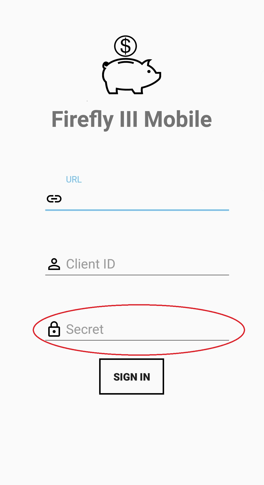

### Firefly III(Android)

An unofficial Android client for [Firefly III](https://github.com/firefly-iii/firefly-iii), written in Kotlin. 

### Disclaimer
This software is using Firefly III APIs. It is under heavy development and should be considered alpha quality as it might work in unexpected ways. In order to use this app, you must first [setup](https://firefly-iii.readthedocs.io/en/latest/installation/server.html) a [Firefly III](https://firefly-iii.org/) instance. 

Other alternative include [this software](https://github.com/mconway/firefly-app/) written by mconway using Ionic framework. 

### Features

✔ Support Kitkat and up!

✔ Offline: View offline data

✔ Automation: Add data non-interactively allowing powerful automation. Read the [wiki](https://github.com/emansih/FireflyMobile/wiki/Automation-via-Android-Intents) for more info.

✔ Reporting: Financial reports give you overview of your spending and income 


### Customization

**Change the default oAuth callback URL**

1. Change `config.hostname` value in [`config.properties`](app/config.properties) to your desired value.
2. Change  the host value for `manifestPlaceholders = [host: "empty"]` in [`build.gradle`](app/build.gradle) to your desired value.

Ensure *both* values **are the same**.

**Certificate pinning**

There are many write up on the internet with regards to certificate pinning. This project shall not go into details.
<sup>[1](https://developer.android.com/training/articles/security-ssl)</sup> <sup>[2](https://medium.com/@appmattus/android-security-ssl-pinning-1db8acb6621e)</sup>
<sup>[3](https://security.stackexchange.com/a/29990)</sup>

A quote from [okhttp docs](http://square.github.io/okhttp/3.x/okhttp/okhttp3/CertificatePinner.html)

>Warning: Certificate Pinning is Dangerous!
Pinning certificates limits your server team's abilities to update their TLS certificates. By pinning certificates, 
you take on additional operational complexity and limit your ability to migrate between certificate authorities. Do not use certificate pinning without the blessing of your server's TLS administrator!

If you are still brave, carry on reading. 

To enable certificate pinning: 

1. Run [`cert_pinning.sh`](scripts/cert_pinning.sh) 
```bash
$ ./cert.sh www.google.com
/C=US/ST=California/L=Mountain View/O=Google LLC/CN=www.google.com
47DEQpj8HBSa+/TImW+5JCeuQeRkm5NMpJWZG3hSuFU=
/C=US/O=Google Trust Services/CN=Google Internet Authority G3
f8NnEFZxQ4ExFOhSN7EiFWtiudZQVD2oY60uauV/n78=
```
###### Script requires bash and openssl to run.

2. Copy the lower-case host name or wildcard pattern to `config.host` in
[`config.properties`](app/config.properties)

3. Copy the sha256 value hash of the certificate's Subject Public Key Info to `config.certpinnervalue` in 
[`config.properties`](app/config.properties)

If you have been following correctly and by using the output from above, your config will be as follows

```
config.host="www.google.com"
config.certpinnervalue="47DEQpj8HBSa+/TImW+5JCeuQeRkm5NMpJWZG3hSuFU="
```


### Running the Software

#### Building

With your device plugged into your PC and ADB enabled
```bash
git clone https://github.com/emansih/FireflyMobile.git
cd FireflyMobile
./gradlew clean installDebug
```


#### Pre-built APK

An APK is provided in the [release page](https://github.com/emansih/FireflyMobile/releases) for convienent purposes. All APKs
are signed with the same release key, this ensure that the APK comes from me and your financial data will not be exposed to nefarious actors. The APK SHA256 public key is `40:F2:02:B8:CC:D1:68:87:56:8A:F7:9E:27:44:5B:E1:82:51:CC:B9:1E:89:08:8B:04:3D:2F:35:A2:0D:C3:8F`. All commits in this repo are signed with my GPG key and the public key can be found on [keybase](https://keybase.io/hisname/pgp_keys.asc) and [Github](https://api.github.com/users/emansih/gpg_keys)


To get latest update notifications, add [this RSS feed](https://github.com/emansih/FireflyMobile/releases.atom). 

It's also available via F-Droid [here](https://f-droid.org/packages/xyz.hisname.fireflyiii/).

If there is enough interest, I might upload it to Google Play Store.

### Authentication
In order to start using this software, you have to create a new client in your Firefly Instance. 
1. Login to your Firefly instance
2. Click on `Options`, then `profile`
3. Scroll down to `OAuth Clients` section and click on `Create New Client`
4. Use any name and ensure you are using `http://empty` as your redirect URL. 
5. Click `save`
6. Copy the client secret that you have just created
7. Paste it into the mobile app login screen under `secret` field

| Ensure you use http://empty as your redirect URL | Copy this    | Paste it on your Android device    |
| ------------------------------ | ------------------------------ | ------------------------------ |
|  |  |  |


### Screenshots

| Dashboard | Piggy Bank | Adding Piggy Bank  | Piggy Bank Details |
| :-: | :-: | :-: | :-: |
|  |  |  |  |

| Transactions | Bills | Login | Report | Bills Details
| :-: | :-: | :-: | :-: | :-: |
|  |  |  |  | 


Thanks to [Screener - Better Screenshots](https://play.google.com/store/apps/details?id=de.toastcode.screener&hl=en) for the device frame!

Icons in this app are taken from:
1. [Flaticon](https://www.flaticon.com/free-icon/piggy-bank-with-dollar-coin_21239)
2. [Material Design Icons](https://materialdesignicons.com)
3. [Android Iconics](https://github.com/mikepenz/Android-Iconics)
4. App icon taken from Firefly III server(favicon). [Original source](https://www.kissclipart.com/dinero-no-png-clipart-service-751-05-jh4t51/download-clipart.html)

### Known Limitations / bugs
Heh... I left this to the last.

Please see [this](https://github.com/emansih/FireflyMobile/projects/1) for updates. 

### License
```
    Copyright (C) 2018 Daniel Quah(emansih)

    This program is free software: you can redistribute it and/or modify
    it under the terms of the GNU General Public License as published by
    the Free Software Foundation, either version 3 of the License, or
    (at your option) any later version.

    This program is distributed in the hope that it will be useful,
    but WITHOUT ANY WARRANTY; without even the implied warranty of
    MERCHANTABILITY or FITNESS FOR A PARTICULAR PURPOSE.  See the
    GNU General Public License for more details.

    You should have received a copy of the GNU General Public License
    along with this program.  If not, see <http://www.gnu.org/licenses/>.
```
